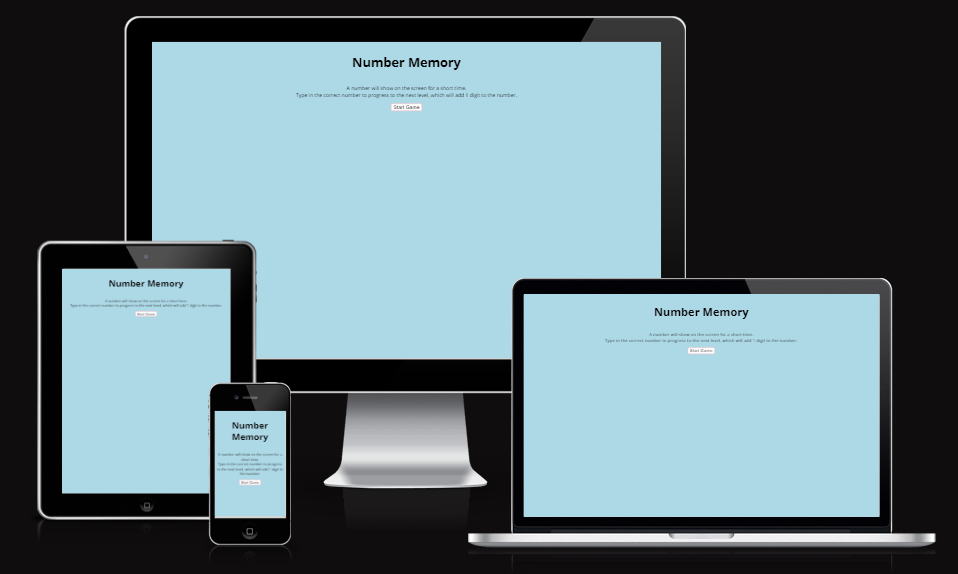
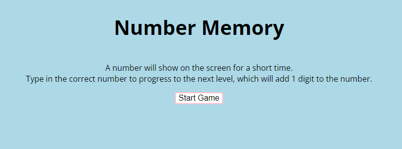
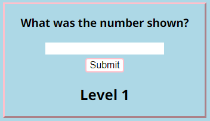
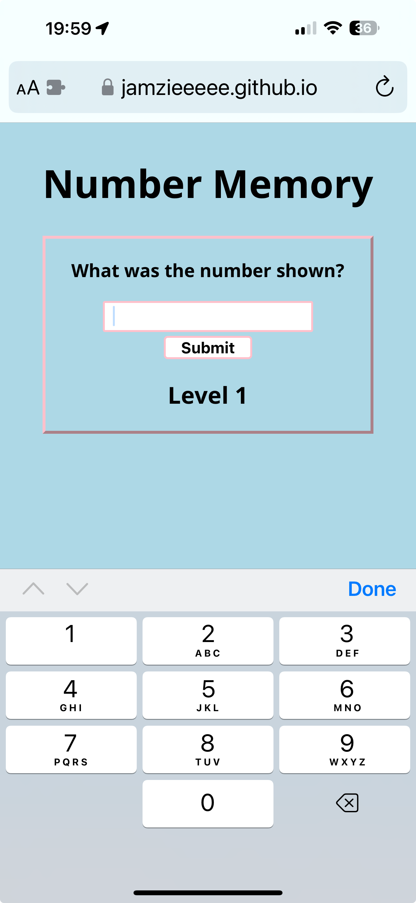
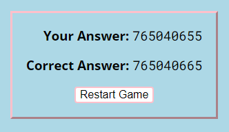
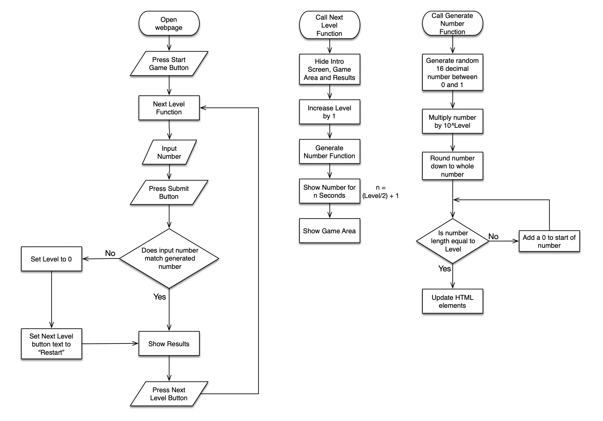
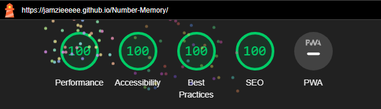

# [NUMBER MEMORY](https://jamzieeeee.github.io/Number-Memory/ "Click to view deployed site")

Number Memory is a site for users to test and improve their short-term memory. It contains a simple digit memorisation game which increases in difficulty as you progress. The site is responsive, and designed to function equally well on mobile, tablet, and desktop devices.

## Features

### Intro Screen

Displayed when the user first enters the site, the intro screen explains to the user the rules of the game and a button to start the game.

### Game

When the user starts the game, a random number is displayed for a short time, which they are then prompted to repeat in the text box and sumbit.\
This screen includes features such as:

- prompt for the user
- auto-focusing text input, with numeric keyboard for touchscreen devices
- submit on enter keypress
- level display

 

### Results Screen

Once the user has submitted their answer, they are shown what they typed and what the correct answer was.
- If their answer was correct, they can continue to the next level.
- If their answer was not correct, they are forced to restart the game from level 1.

### Future Features

- High score system
- Colour coding of correct and incorrect answers
- A practice gamemode
- Allowing the game to continue past level 16

## Javascript Flowchart

## Tools and Technologies Used

- [HTML](https://en.wikipedia.org/wiki/HTML) used for the main site content.
- [CSS](https://en.wikipedia.org/wiki/CSS) used for the main site design and layout.
- [CSS Flexbox](https://www.w3schools.com/css/css3_flexbox.asp) used for an enhanced responsive layout.
- [Javascript](https://en.wikipedia.org/wiki/Javascript) used for game logic.
- [Git](https://git-scm.com) used for version control. (`git add`, `git commit`, `git push`)
- [GitHub](https://github.com) used for secure online code storage.
- [GitHub Pages](https://pages.github.com) used for hosting the deployed front-end site.
- [Gitpod](https://gitpod.io) used for editing and code control.
- [Google Fonts](https://fonts.google.com/) used to search suitable fonts and obtain a download link for that font.

## Testing

- I have confirmed the site renders correctly on multiple divices, including desktop pc and Mac, laptop, tablet, and mobile phones.
- I have tested the site on multiple browsers including Chrome, Firefox, Edge, Opera, and Safari (both desktop and mobile), none of which showed any issues.
- I have checked all user interaction elements and confirmed they work as intended.
- I have had other people test the site and incorporated their feedback where relevant.

### Bugs

#### Solved Bugs

- When the generate number function was called, the variable was not updating the relevent HTML elements with its value.
- This was because the elements were identified by a class selector, which the function returns as an array and was only updating the first element.
- This was solved by using a `for` loop to update each element within the array.

&nbsp;
 <!--Work around github markdown rendering bug-->

- When the generate number fuction was called, sometimes the number did not contain the correct amount of digits.
- This was because if the `Math.random` method returned a number below 0.1, the resulting calculation returned a number with too few significant figures.
- This was solved by converting the number to a string and left-padding it with 0s using `.padStart`.

### Unfixed Bugs

- Past level 16, all generated numbers will end in 0s
- This is because the `Math.random` method produces a number with only 16 digits
- Fixable with a new generate random number function, but not within project timeframe.

### Validator Testing

- No errors found when passing through the official [HTML W3C validator](https://validator.w3.org/nu/?doc=https%3A%2F%2Fjamzieeeee.github.io%2FNumber-Memory%2F)

- No errors found when passing through the official [CSS (Jigsaw) validator](https://jigsaw.w3.org/css-validator/validator?uri=https%3A%2F%2Fjamzieeeee.github.io%2FNumber-Memory%2F&profile=css3svg&usermedium=all&warning=1&vextwarning=&lang=en)

- No errors found when passing through [JSHint](jshint.com)

- The site recieved a 100 rating in all categories from Google Lighthouse

## Deployment

The site was deployed to GitHub Pages. The steps to deploy are as follows:

- In the [GitHub repository](https://jamzieeeee.github.io/Number-Memory/), navigate to the Settings tab.
- From the source section drop-down menu, select the **Main** Branch, then click "Save".
- The page will be automatically refreshed with a detailed ribbon display to indicate the successful deployment.

The live link can be found [here](https://jamzieeeee.github.io/Number-Memory/).

## Credits

### Content

This project was based off the Number Memory game on Human Benchmark
- https://humanbenchmark.com/tests/number-memory

Some code was copied from the Love Maths sample project source code, such as the initial HTML structure.
- https://github.com/Code-Institute-Solutions/love-maths-2.0-sourcecode

Favicon sourced from [favicon.cc](https://www.favicon.cc/?action=icon&file_id=109713)

### Information Sources

Many syntax and language queries were answered by [W3Schools](https://www.w3schools.com), as well as my Father, who is a programmer by occupation.\
Markdown work around to separate 2 lists from [dotCMS](https://www.dotcms.com/docs/latest/markdown-syntax#:~:text=Markdown%20automatically%20joins%20elements%20such,them%20into%20a%20single%20list.).

### Testing

Both of my parents helped with testing and providing feedback for my website, in addition to [Bognogus](https://www.twitch.tv/bognogus)'s twitch stream.